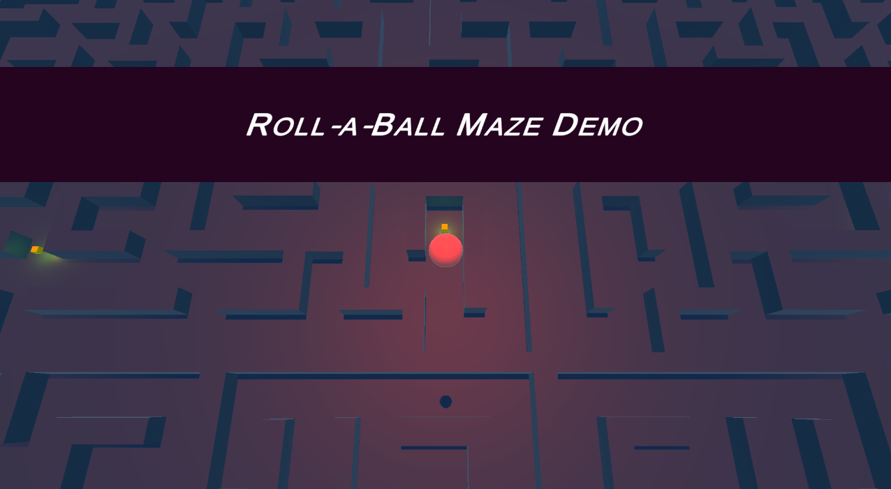

Demonstration mod of the famous "Roll-a-Ball" Unity tutorial, quickly developed for an introductory jam hosted by Insper´s game laboratory.

Navigate through a neon-styled maze (using the WASD keys), trying to find all 10 power batteries before the time runs out!

<h2>Suggested main improvements</h2>

1) Multiple levels with progressive difficulty/maze complexity
2) Randomized positions of collectibles
3) Alternative play mode with player-seeking enemy using A* pathfinding algorithm (and/or versus multiplayer support)
4) Better Menu and map details

<h2>Assets used</h2>

- Maze model: grabcad.com/library/the-maze-1
- Battery collect SFX: mixkit.co/free-sound-effects/arcade/
- Materials: assetstore.unity.com/packages/2d/textures-materials/cyberpunk-material-p...
- Music: www.youtube.com/watch?v=eUb4XPIMdkg&ab_channel=NoCopyrightSounds , www.youtube.com/watch?v=5z_SPHwspo8&ab_channel=NoCopyrightSounds